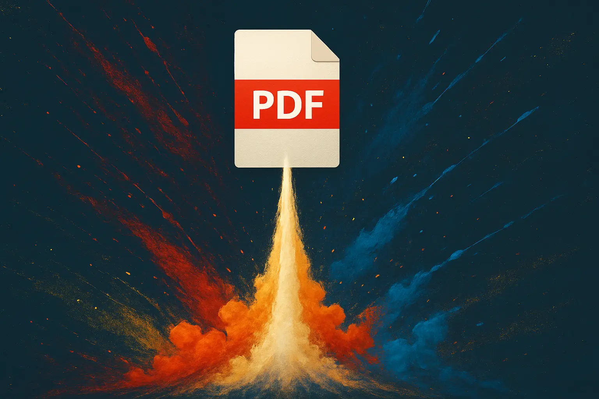

# ERPNext Auto Attach

A simple CLI tool to automatically attach documents to ERPNext by watching a directory for new files.

**Why?** Manually attaching documents to ERPNext can be tedious and error-prone. This tool automates the process, ensuring all files in a directory are attached to your chosen DocType, saving time and reducing mistakes.

> [!TIP]
> Also looking for an easy way to export documents from ERPNext? Check out [erpnext-documents-export](https://github.com/daanlenaerts/erpnext-documents-export)!

## Features
- Watches a specified directory and its subdirectories for new files
- Automatically uploads and attaches new files to a specified ERPNext DocType, based on the filename
- Prevents duplicate uploads by tracking already attached files (in a sqlite database called `erpnext-auto-attach.db`, stored in the current working directory)

## Installation
ERPNext Documents Export is distributed as a binary executable, which you can download below.
Alternatively you can run it with Bun directly.

### Binary executable

For ease of use this tool is distributed as a single binary. It runs on Windows, macOS and Linux.

You can download it for different operating systems here:
- [Linux x64](https://github.com/daanlenaerts/erpnext-auto-attach/releases/download/v1.0.0/eaa-linux-x64)
- [macOS arm64](https://github.com/daanlenaerts/erpnext-auto-attach/releases/download/v1.0.0/eaa-macos-arm64)
- [macOS x64](https://github.com/daanlenaerts/erpnext-auto-attach/releases/download/v1.0.0/eaa-macos-x64)
- [Windows x64](https://github.com/daanlenaerts/erpnext-auto-attach/releases/download/v1.0.0/eaa-windows-x64.exe)
- [Windows x64 (baseline)](https://github.com/daanlenaerts/erpnext-auto-attach/releases/download/v1.0.0/eaa-windows-x64-baseline.exe)


### With Bun

To install dependencies:

```bash
bun install
```

To run:

```bash
bun run index.ts
```

To build:

```bash
bun build ./index.ts --compile --outfile eaa

# For Linux x64
bun build --compile --target=bun-linux-x64 ./index.ts --outfile eaa-linux-x64

# For Windows x64
bun build --compile --target=bun-windows-x64 ./index.ts --outfile eaa-windows-x64

# For Windows x64 (baseline version)
bun build --compile --target=bun-windows-x64-baseline ./index.ts --outfile eaa-windows-x64-baseline

# For macOS arm64
bun build --compile --target=bun-darwin-arm64 ./index.ts --outfile eaa-macos-arm64

# For macOS x64
bun build --compile --target=bun-darwin-x64 ./index.ts --outfile eaa-macos-x64

```

This project was created using `bun init` in bun v1.1.0. [Bun](https://bun.sh) is a fast all-in-one JavaScript runtime.

## Usage

All general options:
```
Options:
  -u, --url <url>            ERPNext URL
  -k, --key <key>            API key
  -s, --secret <secret>      API secret
  -h, --help                 display help for command

Commands:
  watch <doctype> <dir>      watch for new files in a directory and attach them to ERPNext
  help [command]             display help for command
```

To watch a directory and automatically attach new files to a DocType, use the `watch` command:
```
Usage: erpnext-auto-attach watch <doctype> <dir>

watch for changes in a directory and attach them to ERPNext

Arguments:
  doctype                    DocType to upload to
  dir                        Directory to watch

Options:
  -u, --url <url>            ERPNext URL
  -k, --key <key>            API key
  -s, --secret <secret>      API secret
  -h, --help                 display help for command
```

For example, to watch a directory for new files and attach them to the 'Purchase Invoice' DocType:
```bash
erpnext-auto-attach -u https://your-erpnext-site.com -k YOUR_API_KEY -s YOUR_API_SECRET watch "Purchase Invoice" ./watched-directory
```